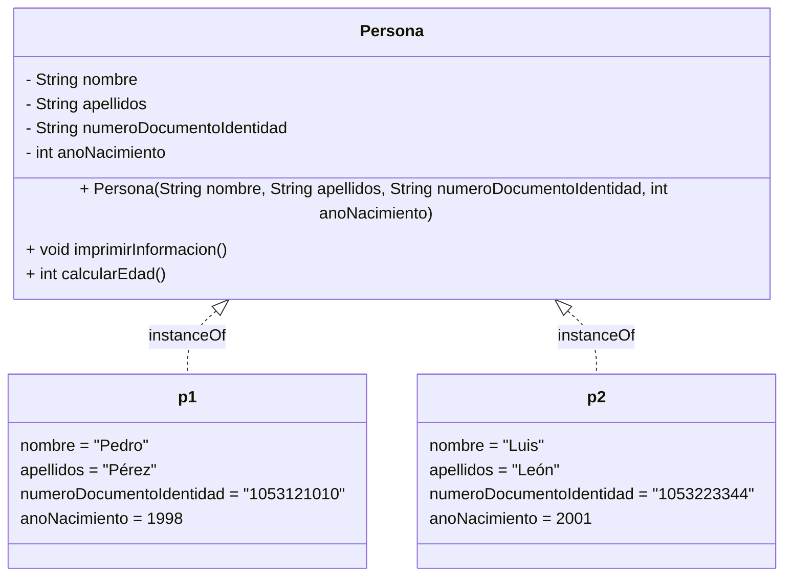

...existing code...
# Ejercicio Persona - Juan Davi Ortiz

## Diagrama de clases (Mermaid)

```mermaid
classDiagram

class Persona {
  - String nombre
  - String apellidos
  - String numeroDocumentoIdentidad
  - int anoNacimiento

  + Persona(String nombre, String apellidos, String numeroDocumentoIdentidad, int anoNacimiento)
  + void imprimirInformacion()
  + int calcularEdad()
}

class p1 {
  nombre = "Pedro"
  apellidos = "Pérez"
  numeroDocumentoIdentidad = "1053121010"
  anoNacimiento = 1998
}

class p2 {
  nombre = "Luis"
  apellidos = "León"
  numeroDocumentoIdentidad = "1053223344"
  anoNacimiento = 2001
}

Persona <|.. p1 : instanceOf
Persona <|.. p2 : instanceOf
```
...existing